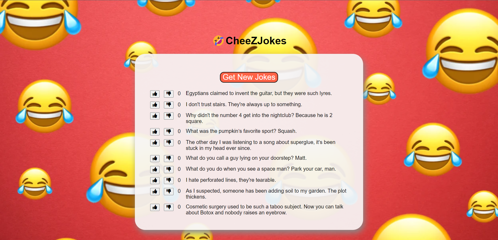

# React CheeZJokes App



## Description: 

In this assignment, I was given a fully functional app that lets people view and vote on cheesy jokes. To generate jokes, it uses the [ICanHazDadJoke API](https://icanhazdadjoke.com/api).

When the page loads, the application fetches 10 jokes, making sure that no joke appears more than once on the page.

The application lists the jokes, along with a “vote-up” button, a “vote-down” button, and the net score (up - down) for each joke. Users can vote, and the net score updates.

At first, the application was written using hooks and function components (this version consists of the files Joke.js and JokeList.js in the src folder). My challenge was to refactor the app to use class-based components. 

## Tools Used: 

* [React.js](https://reactjs.org/)

## Initialization:

```
npm install && npm start
```